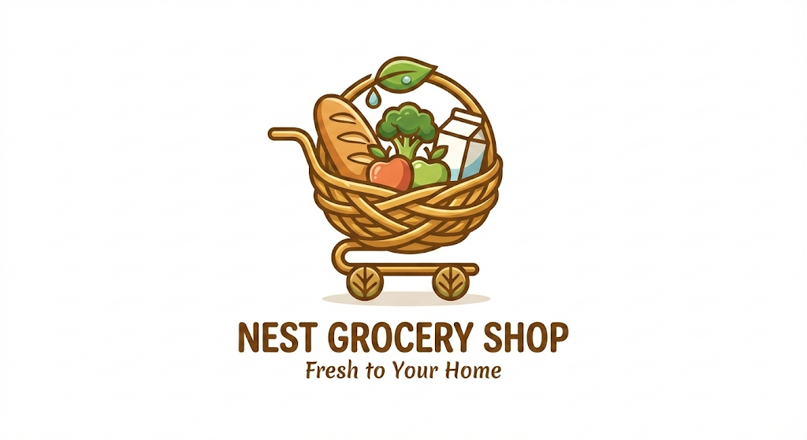

# Nest Grocery Shop



A modern e-commerce platform for organic groceries built with React, Vite, and Tailwind CSS.

## Features

- 🛒 Complete e-commerce functionality
- 🔐 User authentication with Clerk
- 💳 Secure payment processing with Stripe
- 📱 Responsive design for all devices
- 🔍 Product search and filtering
- 📦 Shopping cart with Redux Persist
- 📊 React Query for efficient data fetching

## Tech Stack

- **Frontend**: React 18, Vite
- **Styling**: Tailwind CSS
- **State Management**: Redux Toolkit
- **Data Fetching**: TanStack React Query
- **Authentication**: Clerk
- **Payment Processing**: Stripe
- **Routing**: React Router
- **Notifications**: React Hot Toast
- **UI Components**: Headless UI, React Icons, Swiper

## Getting Started

### Prerequisites

- Node.js (v16 or higher)
- npm or yarn

### Installation

1. Clone the repository
```bash
git clone https://github.com/yourusername/nest-grocery-shop.git
cd nest-grocery-shop/nest_client
```

2. Install dependencies
```bash
npm install
# or
yarn
```

3. Create a `.env` file in the root directory with the following variables:
```
VITE_API_URL=http://localhost:5000
VITE_CLERK_PUBLISHABLE_KEY=your_clerk_publishable_key
```

4. Start the development server
```bash
npm run dev
# or
yarn dev
```

5. Open your browser and navigate to `http://localhost:5173`

## Project Structure

```
nest_client/
├── public/
├── src/
│   ├── assets/
│   ├── components/
│   │   ├── common/
│   │   │   ├── Footer/
│   │   │   ├── Header/
│   │   │   └── ...
│   │   └── shared/
│   ├── hooks/
│   ├── pages/
│   │   ├── About/
│   │   ├── Blog/
│   │   ├── Home/
│   │   ├── Shop/
│   │   └── ...
│   ├── providers/
│   ├── redux/
│   ├── routes/
│   ├── main.jsx
│   └── index.css
├── .gitignore
├── index.html
├── package.json
├── tailwind.config.js
└── vite.config.js
```

## Deployment

This project is configured for deployment on Vercel. The `vercel.json` file includes the necessary rewrites for client-side routing.

## Backend

The backend for this project is located in the `nest_server` directory. It's built with Express and MongoDB.

## License

[MIT](LICENSE)

## Acknowledgements

- [React](https://reactjs.org/)
- [Vite](https://vitejs.dev/)
- [Tailwind CSS](https://tailwindcss.com/)
- [Redux Toolkit](https://redux-toolkit.js.org/)
- [React Query](https://tanstack.com/query/latest)
- [Clerk](https://clerk.dev/)
# nest_client
